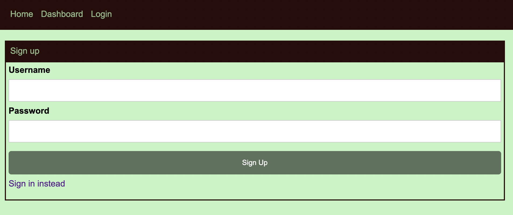
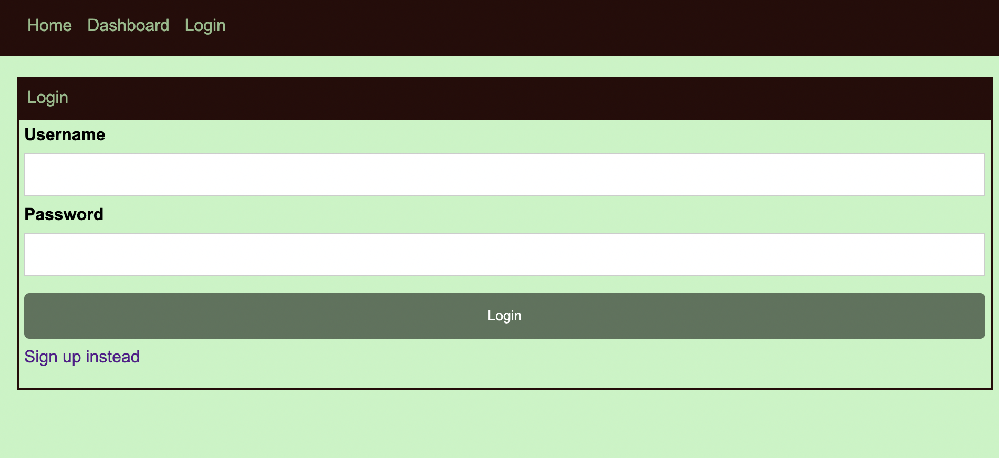
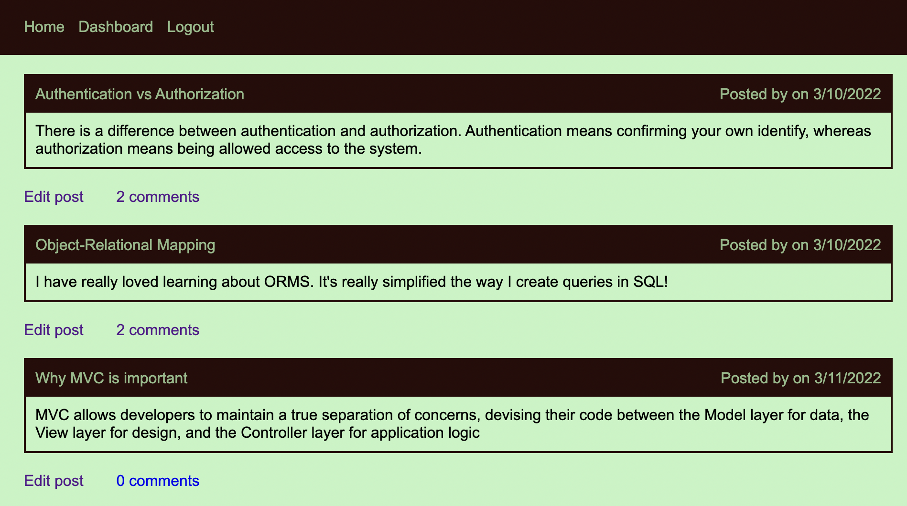

# MVC Tech Blog

## Purpose
To create a CMS-style blog site similar to Wordpress, where developers can post their blogs on to the site.  It will allow other developers to post any comments about the blogs. It also allows the user to post, edit, delete, or update their posts.

## Built With
- HTML
- CSS
- JavaScript
- Node.js
- Express.js
- Express-Session
- Express-handlebars
- Bcrypt
- Connection-session-sequelize
- Sequelize
- MySql
- Deploy to heroku

## Github Link
https://github.com/p-her/Tech-Blog-MVC

## Heroku Link
https://pher-tech-blog.herokuapp.com/
